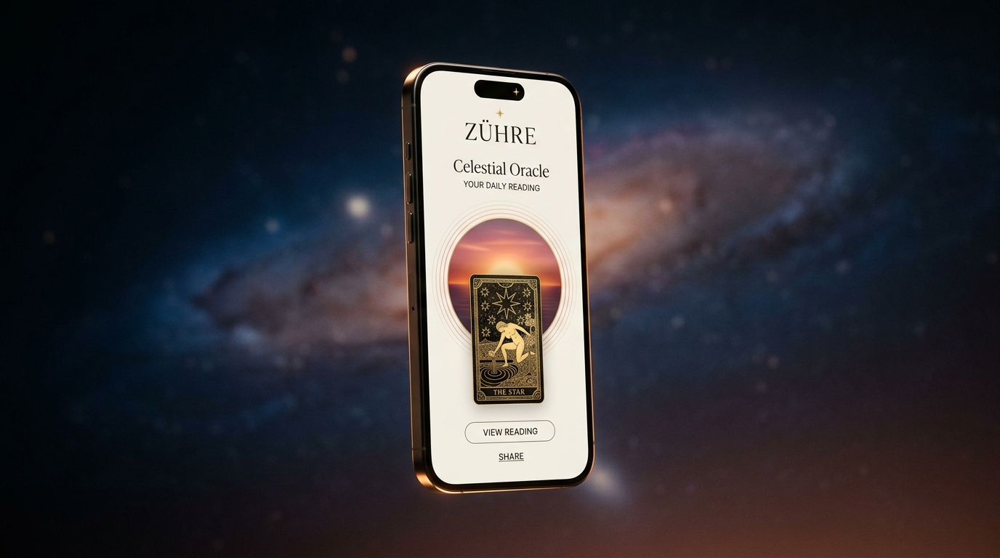
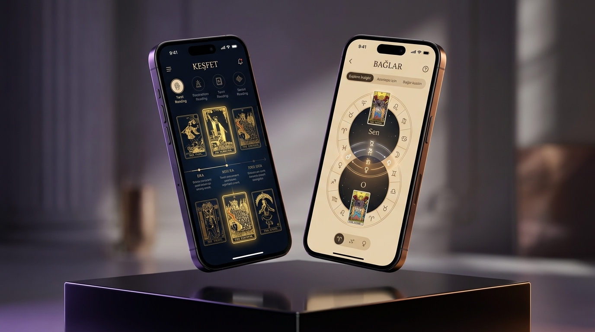
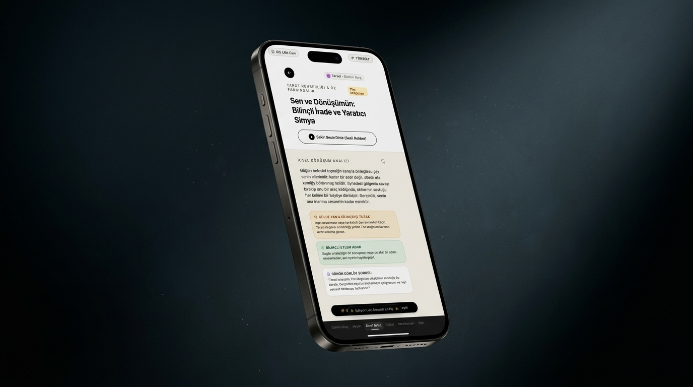
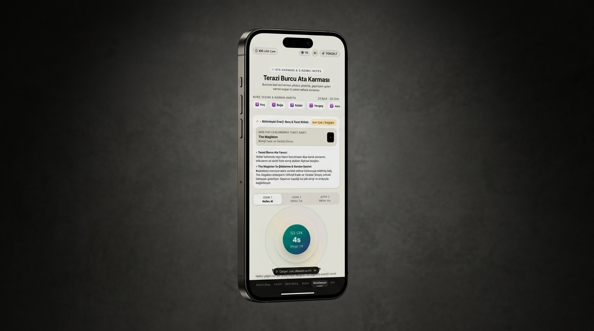
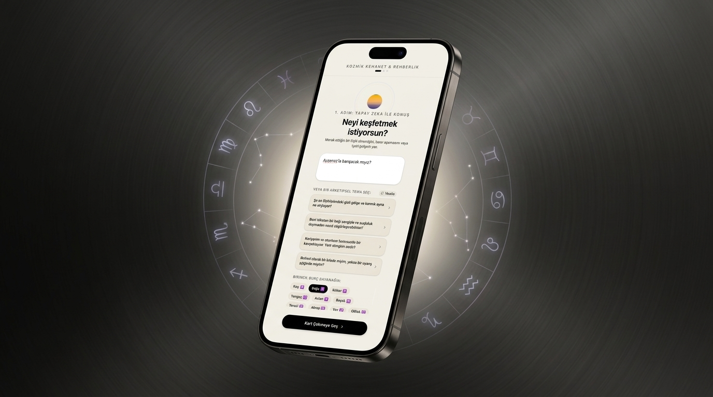

# ✦ Zühre (زهرة) • Cosmic Patterns & Tarot Intelligence

[](https://zuhre-be-self-aware.vercel.app)
[](https://vercel.com/new/clone?repository-url=https%3A%2F%2Fgithub.com%2F00cerenbozkurt%2Fzuhre-self-awareness-app&env=GEMINI_API_KEY&envDescription=Google%20AI%20Studio%20Gemini%20API%20Key)
[](LICENSE)
[](https://nextjs.org/)
[](https://react.dev/)
[](https://ai.google.dev/)
[](https://web.dev/progressive-web-apps/)

> **"Kendini bilen, evrenin ve arketiplerin dilini çözer."**  
> *The Pattern* ve *Co-Star* estetiğinden ilham alan, astrolojiden destek alan fakat odağında derin **Tarot Arketipleri**, **Ata Karması Çözümlemesi** ve **Bilinçdışı Gölge Çalışması** barındıran yeni nesil kişisel farkındalık web ve mobil uygulaması.

<p align="center">
  <a href="https://zuhre-be-self-aware.vercel.app" target="_blank">
    
  </a>
</p>

> 🌐 **Canlı Deneyimleyin:** [https://zuhre-be-self-aware.vercel.app](https://zuhre-be-self-aware.vercel.app)

---

## 🌟 Öne Çıkan Modüller ve Özellikler

### 1. 👁️ Odak Lens (Daily Lens)
- **Günün Tarot Hizalanması:** Her gün desteden çekilen bir tarot kartı ile kullanıcının seçtiği baskın burcun sentezi.
- **Kozmik Halka & Ses Manzarası:** Doğa sesleri, 528 Hz kristal frekansları ve sakin sesli içgörüler.
- **Dinamik Arketipsel Yorum:** Yüzeysel burç falları yerine psikolojik, eylemsel ve ruhsal rehberlik.

### 2. 📜 Keşfet (Discover & Esoteric History)
- **Tarotun Derin Tarihi:** 15. yy Visconti-Sforza, 17. yy Marsilya, 1909 Rider-Waite Smith ve Carl G. Jung Analitik Psikolojisi dönemleri.
- **Etkileşimli Akordeon:** Bloklara tıklandığında dönemin felsefi arka planı, ezoterik inovasyonları ve figürleri detaylı hikayelerle genişler.
- **Tüm 22 Büyük Arkana Kartı:** 0'dan (Deli) 21'e (Dünya) kadar her kartın simgesel şifresi, İbrani harfi, astrolojik bağı ve Jungian gölge analizi.

### 3. 🔍 Derin Bakış (In-Depth Self-Awareness)
- Çekilen kart ve burcun birleşimiyle **Gölge Yan / Bilinçdışı Tuzak**, **Bilinçli Eylem Adımı** ve **Günün Günlük Sorusu**.
- Yerleşik sesli rehber ile derin içgörüyü dinleme imkanı.

### 4. 🔗 Bağlar & Uyum (Bonds & Karmic Connections)
- **Çift Yönlü Astro-Tarot Sentezi:** Hem kullanıcı hem de partner için hem **Burç** (ve element) hem de özel **Tarot Kartı** seçimi.
- Romantik, Dostluk, Karmik ve Aile bağ dinamiklerinin Gemini 3.5 yapay zekası ile sentezlenmesi.
- Hazır profiller (Alex, Maya, Deniz, Can) ve hızlı kart karıştırma.

### 5. 🧘 Meditasyon (Ata Karması & 3 Adımlı Nefes)
- Burca ve tarot arketipine özel atasal yük ve karmik kordon tespiti.
- **3 Aşamalı Nefes Navigasyonu:**
  - 1. Döngü: Ata Köklerini Tanıma & Kabul
  - 2. Döngü: Karmik Bağı İdrak Etme & Dönüştürme
  - 3. Döngü: Kordon Kesimi & Özgürleşme
- Saf görsel nefes rehberi ve Tibet kasesi / gong akustik sesleri (sesli yönlendirme olmadan duru odaklanma).

### 6. 👤 Sen (Kişiselleştirilmiş Profil)
- **Derin Özelleştirme:** İsim, kullanıcı adı (@zuhre.soul), Baskın (Güneş) Burç, Yükselen Burç, Ay Burcu.
- **Ruh Tarot Kartı Arketipleri:** 22 kart arasından ruhunu temsil eden kartı atama.
- **Kişisel Niyet / Biyo:** Öz farkındalık manifestosu.
- **5 Kozmik Aura Teması:** Kozmik Altın, Ametist Moru, Zümrüt Yeşili, Safir Mavisi, Obsidyen Gece.

### 7. 🔮 Yapay Zeka Kozmik Danışmanlık (Gemini 3.5 Oracle)
- 3 kartlı lüks tarot açılımı ve soru sorma alanı.
- **Dinamik Arketipsel Şema Havuzu:** Her açılışta 16 soruluk Jungian gölge havuzundan rastgele 4 yeni soru ve `🎲 Yenile` butonu.
- Özet ve tam içgörü raporları, tek tıkla panoya kopyalama.

### 8. 📱 PWA & Mobil Tam Ekran Deneyimi
- iOS Safari'de *"Ana Ekrana Ekle"* ve Android Chrome'da *"Uygulamayı Yükle"* desteği.
- Standalone modda adres çubuğu olmadan saf native uygulama hissi.
- Özel tasarlanmış 512px SVG Zühre yıldızı uygulama ikonu.

<p align="center">
  
</p>

### 📱 Mobil Arayüz Önizlemeleri (iPhone 18 Pro Max)

<p align="center">
  
  
  
</p>

---

## 🌐 English Summary

**Zühre (زهرة)** is an AI-driven personal self-awareness and psycho-spiritual analysis platform built with Next.js 16, React 19, Tailwind CSS, and Google Gemini AI. Moving beyond superficial horoscopes, it synthesizes Carl G. Jung's analytical psychology, the 22 Major Arcana tarot archetypes, and ancestral karmic cord-cutting into an interactive, celestial web and mobile (PWA) experience.

- **Live Application:** [https://zuhre-be-self-aware.vercel.app](https://zuhre-be-self-aware.vercel.app)
- **Key Modules:** Daily Lens, 22 Major Arcana History & Symbolic Explorer, In-Depth Archetypal Shadow Work, Dual Astro-Tarot Relationship Bonds, 3-Stage Ancestral Breath Meditation, and AI Oracle Consultation powered by Gemini.

---

## 🛠️ Teknoloji Yığını

- **Framework:** [Next.js 16 (App Router & Turbopack)](https://nextjs.org/)
- **Kütüphaneler:** React 19, Framer Motion, Lucide React, Canvas Confetti
- **Yapay Zeka:** Google Gemini 3.5 Flash Lite (AI Studio API)
- **Ses Sentezi & Efektler:** Web Audio API (Prosedürel kristal çanlar, Tibet kaseleri, rüzgar çanları ve Lofi atmosfer akışı)
- **Stil & Tasarım:** Tailwind CSS, Glassmorphism, The Pattern estetiği, adaptif iOS Liquid Glass & Android Material You temaları

---

## 🚀 Canlıya Dağıtım (Deploy)

### 1. Vercel ile Tek Tıkla Dağıtım (Önerilen)
En hızlı ve otomatik yöntem Vercel'dir:

1. [Vercel Dağıtım Bağlantısına Tıklayın](https://vercel.com/new/clone?repository-url=https%3A%2F%2Fgithub.com%2F00cerenbozkurt%2Fzuhre-self-awareness-app&env=GEMINI_API_KEY&envDescription=Google%20AI%20Studio%20Gemini%20API%20Key).
2. GitHub hesabınızla giriş yapıp repoyu bağlayın.
3. `GEMINI_API_KEY` alanına Google AI Studio API anahtarınızı girin.
4. **Deploy** butonuna basın; canlı URL'niz (`https://zuhre-be-self-aware.vercel.app`) hazır olacaktır.

### 2. Yerel Kurulum (Local Development)

```bash
# Repoyu klonlayın
git clone https://github.com/00cerenbozkurt/zuhre-self-awareness-app.git
cd zuhre-self-awareness-app

# Bağımlılıkları yükleyin
npm install

# .env.local dosyanızı oluşturun (.env.example şablonunu kullanabilirsiniz)
cp .env.example .env.local
# GEMINI_API_KEY değerini kendi anahtarınızla güncelleyin

# Geliştirme sunucusunu başlatın
npm run dev
```

Tarayıcınızda `http://localhost:3000` adresini açarak uygulamayı deneyimleyebilirsiniz.

---

## 📜 Lisans

Bu proje [MIT Lisansı](LICENSE) kapsamında açık kaynak olarak lisanslanmıştır. Detaylar için [`LICENSE`](LICENSE) dosyasını inceleyebilirsiniz.
